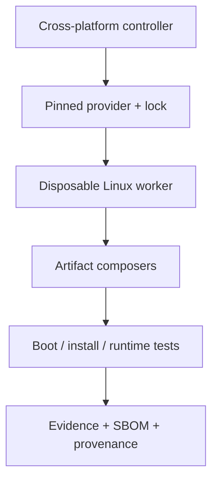

# LFSWeaver

**Reproducible Linux From Scratch, woven into verified systems and images.**

[](https://github.com/Yunushan/lfsweaver/actions/workflows/ci.yml)
[](LICENSE)
[](pyproject.toml)

LFSWeaver is an independent, declarative controller for building and testing
Linux From Scratch family systems. It is designed to turn pinned upstream
books, profiles, hints, and allowlisted patches into root filesystems, OCI
images, raw disks, installer ISOs, and Kubernetes node images—with a public
evidence trail for every support claim.

> [!IMPORTANT]
> **Current maturity: pre-alpha foundation (P0).** Manifest validation,
> deterministic planning, release discovery, support-ledger validation,
> templates, tests, and CI are implemented. Full LFS compilation and artifact
> composers are the next milestones. No bootable artifact is currently claimed
> as verified. See [`evidence/support.json`](evidence/support.json) for the
> machine-readable truth and [ROADMAP.md](ROADMAP.md) for delivery phases.

LFSWeaver is not affiliated with or endorsed by the Linux From Scratch
project. “LFS,” “BLFS,” “ALFS,” “MLFS,” “GLFS,” and “SLFS” refer to their
respective upstream projects.

## Why this project exists

Existing LFS automation repositories solve useful slices of the problem: a
script generator, a staged personal build, a Docker-to-ISO pipeline, an
embedded cross-build framework, or a desktop layer. None of the six reference
projects covers the full matrix of current LFS-family books, both relevant init
lanes, i386 and x86_64, multiple artifact formats, cross-platform control, and
public end-to-end evidence.

LFSWeaver therefore starts with three rules:

1. **Never confuse controller support with native build-host support.** The CLI
   may run on many operating systems, but compilation happens in a disposable
   Linux worker because upstream LFS requires a Linux kernel and GNU host tools.
2. **Never write “100% supported” without scoped proof.** A claim is verified
   only for an exact artifact, commit, upstream lock, date, runner, and test
   suite.
3. **Never silently adapt to upstream changes.** Release detection and pull
   request generation may be autonomous; unknown book semantics fail closed and
   require review before promotion.

## What is implemented now

- dependency-free Python 3.11+ controller;
- TOML build manifests and compatibility validation;
- deterministic JSON build-plan generation with SHA-256 identity;
- rules for current and pinned legacy init/architecture combinations;
- explicit rootfs, OCI, Docker, raw, ISO, K3s, and RKE2 output planning;
- HTTPS + SHA-256 requirements for user-supplied patches;
- host/backend diagnostics with `doctor`;
- official upstream release discovery that ignores release candidates;
- evidence ledger that blocks unproved `verified` claims;
- starter templates for LFS 13.0 systemd, LFS 12.4 SysV, and RKE2 nodes;
- unit tests and a Linux/Windows/macOS GitHub Actions matrix;
- scheduled upstream drift detection.

The Linux worker, book providers, artifact composers, and end-to-end verifiers
are deliberately tracked as planned until they produce public reports.

## Quick start

```bash
git clone https://github.com/Yunushan/lfsweaver.git
cd lfsweaver
python3 -m pip install --no-deps -e .

lfsweaver init
lfsweaver validate lfsweaver.toml
lfsweaver doctor --executor docker
lfsweaver plan lfsweaver.toml --output build/plan.json
lfsweaver evidence evidence/support.json
```

Run the test suite without installing the package:

```bash
PYTHONPATH=src python3 -m unittest discover -s tests -v
```

## Manifest example

```toml
schema_version = 1

[project]
name = "my-lfs-system"
workspace = ".lfsweaver"

[upstream]
family = "lfs"
version = "13.0"
channel = "stable"
init = "systemd"
hints = []
patches = []

[target]
architecture = "x86_64"
profile = "minimal"
outputs = ["rootfs", "oci", "raw"]
hostname = "lfsweaver"

[executor]
kind = "docker"
image = "ubuntu:24.04"
privileged = true

[engine]
kind = "jhalfs"

[verification]
package_tests = true
boot = true
install = false
reproducible = true
sbom = true
provenance = true
```

The manifest is a stable user contract. Upstream-specific details belong in
versioned providers, not hard-coded controller branches. See the complete
[examples](examples/) and [JSON Schema](schemas/manifest.schema.json).

## Command map

| Command | Purpose |
|---|---|
| `lfsweaver init` | Create a conservative starter manifest |
| `lfsweaver validate` | Enforce schema and upstream compatibility constraints |
| `lfsweaver plan` | Generate an immutable, deterministic build plan |
| `lfsweaver doctor` | Inspect controller, Linux-worker, container, SSH, and QEMU prerequisites |
| `lfsweaver release` | Check an official LFS-family news feed for the latest stable release |
| `lfsweaver evidence` | Validate capability claims and mandatory proof fields |

Future commands (`source sync`, `lock update`, `build`, `verify`, `install`,
`publish`) will only be released when their destructive and end-to-end tests
exist.

## Upstream reality in July 2026

LFSWeaver models upstream facts instead of inventing combinations upstream no
longer publishes.

| Family | Current lane | Architectures | SysV position | Automation position |
|---|---|---|---|---|
| LFS | 13.0 systemd | i386, x86_64 | 12.4 is the pinned legacy lane | Official jhalfs can extract and run book instructions |
| BLFS | 13.0 systemd | i386, x86_64 | 12.4 is the pinned legacy lane | Curated profiles; upstream says roughly 1% still needs edits |
| MLFS | 13.0 systemd | x86_64 multilib | No current SysV lane | Planned provider |
| GLFS | 13.0 systemd | x86_64 | Historical only | Curated gaming/GPU profiles require hardware runners |
| SLFS | 13.0 systemd | x86_64 | Historical only | Curated supplemental profiles |
| Hints | Prose collection | Varies | Varies | Indexed metadata and opt-in adapters, never universal auto-application |
| Patches | Patch collection | Varies | Varies | Book-required or explicitly allowlisted, checksum-pinned patches only |

Authoritative sources: [LFS 13.0](https://www.linuxfromscratch.org/lfs/view/13.0-systemd/),
[LFS host requirements](https://www.linuxfromscratch.org/lfs/view/13.0-systemd/chapter02/hostreqs.html),
[ALFS/jhalfs](https://www.linuxfromscratch.org/alfs/),
[MLFS](https://www.linuxfromscratch.org/mlfs/),
[GLFS](https://www.linuxfromscratch.org/glfs/), and
[SLFS](https://www.linuxfromscratch.org/slfs/).

## Controller, worker, and artifact are different things



| User platform | Controller | Where compilation runs |
|---|---|---|
| Linux x86_64 | Native CLI | Native disposable worker, VM, container, or remote Linux |
| Windows / Windows Server | Native CLI | WSL2, Hyper-V/QEMU Linux VM, container VM, or remote Linux |
| macOS Intel / Apple Silicon | Native CLI | Linux VM or remote Linux; x86 on Apple Silicon uses slow emulation |
| FreeBSD / OpenBSD | Python CLI where available | bhyve/QEMU Linux VM or remote Linux |
| Solaris / illumos | Python CLI where available | Remote Linux; local QEMU is experimental |
| Android | Termux/remote controller path | Remote Linux; rooted local emulation remains experimental |
| iOS | Planned web/Shortcuts remote client | Remote Linux only; stock iOS local builds are unsupported |

“Supported on Windows/macOS/BSD/Solaris/Android/iOS” therefore means those
systems can control an appropriate Linux builder—not that the upstream LFS
book can compile natively on a non-Linux kernel.

## Artifact semantics

- **rootfs**: filesystem archive with package and chroot smoke tests;
- **OCI / Docker**: userland image using the runtime host kernel; init and a
  bootloader normally do not run inside it;
- **raw disk**: partitioned, bootable disk image; x86_64 targets BIOS + UEFI,
  while i386 starts with BIOS and treats UEFI32 as experimental;
- **installer ISO**: must boot, install to a blank virtual disk, eject the ISO,
  boot the installed disk, and pass SSH/smoke tests;
- **K3s / RKE2 node image**: a bootable x86_64 systemd OS image preloaded and
  configured for the cluster runtime—not merely an OCI workload image.

Current K3s and RKE2 releases do not support i386. LFSWeaver rejects that
combination instead of creating a misleading plan.

## What “verified” means

| State | Meaning |
|---|---|
| **Verified** | Exact released artifact passed every release-blocking E2E test; public workflow, report, timestamp, environment, and artifact SHA-256 are recorded |
| **Tested** | A scoped CI smoke or component test passed, but the complete artifact release gate did not |
| **Experimental** | Implementation exists, but no release-blocking evidence matrix exists yet |
| **Planned** | Contract, schema, profile, or roadmap exists; working implementation is not claimed |
| **Unsupported** | Upstream or platform constraints make the combination unavailable |

The source of truth is [`evidence/support.json`](evidence/support.json). A
verified release will also publish SPDX and CycloneDX SBOMs, source and license
inventories, checksums, vulnerability results, and in-toto/SLSA provenance.
Read [docs/verification.md](docs/verification.md) for the required gates.

## Release-aware maintenance

LFS releases normally arrive around six-month intervals. LFSWeaver's lifecycle
is designed to:

1. check official news and Git refs on a schedule;
2. open a lock update containing exact book commits, source URLs, checksums,
   patches, and builder-image digests;
3. produce a semantic diff of packages, commands, dependencies, and boot steps;
4. fail closed on unknown structures;
5. run development/RC canaries in disposable workers;
6. promote a stable combination only after the mandatory full matrix passes.

Detection, pull-request creation, building, and testing can be autonomous.
Semantic changes still require human review; no tool can truthfully guarantee
automatic compatibility with every future book revision. See
[docs/upstream-lifecycle.md](docs/upstream-lifecycle.md).

## Safety model

LFS and disk-image builds execute third-party build systems and may require
mounts, loop devices, or virtualization. A privileged container is **not** a
security boundary. Full builds belong in disposable Linux VMs or dedicated
workers.

Physical installation support will:

- default to a dry run;
- reject a mounted current root device;
- require a target-device allowlist;
- display model, serial, size, and partition table;
- require an explicit noninteractive safety token or typed confirmation;
- write only blank/explicit targets; and
- boot-test the result where the environment permits.

No destructive installer is shipped in the current release.

## Repository layout

```text
src/lfsweaver/       cross-platform controller and plan/evidence contracts
schemas/             manifest and provider JSON schemas
compat/jhalfs/       ALFS/jhalfs adapter contract and license boundary
templates/           reusable profile, executor, and output snippets
examples/            complete, validation-tested manifests
evidence/            machine-readable capability claims
scripts/             CI and maintenance helpers
tests/               unit and contract tests
docs/                architecture, verification, parity, and lifecycle design
```

## Reference-project coverage

LFSWeaver tracks useful behavior from the six reference projects in
[docs/reference-parity.md](docs/reference-parity.md). It does not copy GPL or
unlicensed source into this 0BSD repository. In short:

- LFSInstaller inspires release catalogs and phased generation;
- LFSDesktopProject is modeled as an optional desktop profile, not a builder;
- lumenthi and luisgbm inspire explicit phase/log boundaries;
- reinterpretcat inspires isolated ISO/rootfs composition;
- jfdelnero inspires provider/profile inheritance and target adapters.

Parity is recorded as implemented, planned, or intentionally out of scope—not
as a blanket “100%” claim against moving repository heads.

## Contributing and support

Start with [CONTRIBUTING.md](CONTRIBUTING.md), [SECURITY.md](SECURITY.md), and
[SUPPORT.md](SUPPORT.md). New capability claims must add tests and evidence;
changing prose alone cannot promote support.

## Licensing

Original LFSWeaver code is released under the [0BSD license](LICENSE).
Downloaded books, patches, packages, generated instruction scripts, and final
artifacts retain their upstream licenses. In particular, LFS book text is not
relicensed as 0BSD. See [THIRD_PARTY_NOTICES.md](THIRD_PARTY_NOTICES.md) and
[docs/licensing.md](docs/licensing.md).
